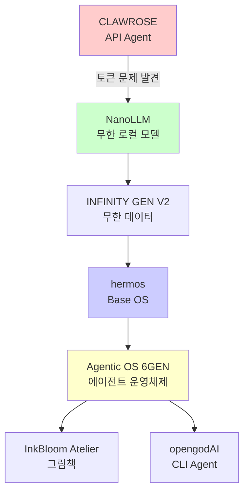

[README-V2.md](https://github.com/user-attachments/files/32694712/README-V2.md)

# -# 🌹 Agentic OS Ecosystem

<div align="center">

[Version](https://img.shields.io/badge/version-6GEN-blue?style=for-the-badge)
[Browser Native](https://img.shields.io/badge/100%25-Browser_Native-00D9FF?style=for-the-badge)
[Tokens](https://img.shields.io/badge/Tokens-∞_Unlimited-FF6B6B?style=for-the-badge)
[License](https://img.shields.io/badge/license-MIT-green?style=for-the-badge)

**API 에이전트의 한계를 로컬 무한 토큰 OS로 해결하기까지의 여정**

[🚀 Quick Start](#-quick-start) • [📦 Projects](#-projects) • [🏗️ Architecture](#️-architecture) • [💡 Philosophy](#-core-philosophy)

</div>

---

## 📑 Table of Contents

- [About](#-about)
- [Architecture](#️-architecture)
- [Projects](#-projects)
- [Performance](#-performance)
- [Tech Stack](#️-tech-stack)
- [Roadmap](#-roadmap)

---

## 👋 About

> **하나의 똑똑한 에이전트보다, 여러 에이전트가 운영체제처럼 가장 효율적으로 협업하는 방법이 더 중요하다.**

저는 AI 에이전트의 비효율성을 해결하기 위해 **Base OS부터 모델, 데이터, 실행 엔진까지 직접 개발**하며 Agentic OS 생태계를 구축했습니다.

### ✨ Key Highlights

- [x] 100% 브라우저 네이티브, 서버 없음
- [x] API 키 0개, 토큰 무제한
- [x] 0.5초 부팅 Base OS
- [x] 토큰 사용량 70% 절감

---

## 🏗️ Architecture



### Flow

| Stage | Project | Role | Problem Solved |
|:---:|:---:|:---:|---|
| 1️⃣ | **CLAWROSE** | 첫 대규모 프로젝트 | 시작 |
| 2️⃣ | **NanoLLM** | 무한 로컬 모델 | 💸 토큰 비용 해결 |
| 3️⃣ | **INFINITY GEN V2** | 무한 데이터 생성기 | 📊 데이터 부족 해결 |
| 4️⃣ | **hermos** | Base OS | 🏠 살 집 필요 |
| 5️⃣ | **6GEN** | 에이전트 OS | 🧠 협업 시스템 |
| 6️⃣ | **InkBloom + opengodAI** | 친구들 | 🎨 확장 |

---

## 📦 Projects

### 1. CLAWROSE

<details>
<summary><b>🔍 자세히 보기 - 첫 대규모 프로젝트</b></summary>

- **What:** 목표를 주면 스스로 계획하고 실행하는 API 기반 에이전트
- **Problem I Found:**
  > ```bash
  > Error: Token limit exceeded...
  > 작업이 중간에 멈춰버림
  > ```
- **Learned:** 로컬 기반 무제한 에이전트의 필요성

</details>

### 2. NanoLLM - 100% Browser LLM

<details>
<summary><b>🔍 자세히 보기 - 무제한 로컬 모델</b></summary>

```javascript
// 100% 브라우저에서만 돌아감
const model = new NanoLLM({
  params: "10M",
  format: ".nanollm",
  storage: "IndexedDB",
  tokens: Infinity // 무제한!
});

await model.train(); // 브라우저에서 학습
await model.chat("안녕"); // 브라우저에서 대화
await model.download(); // 브라우저에서 저장
```

- **Tech:** `.nanollm` 자체 포맷, KV-cache 최적화
- **Features:**
  - ✅ 서버 없음
  - ✅ API 키 없음
  - ✅ 오프라인 추론
  - ✅ 렉 & 반복 버그 해결

</details>

### 3. INFINITY GEN V2

<details>
<summary><b>🔍 자세히 보기 - 초고속 데이터 생성기</b></summary>

| 환경 | 속도 |
|---|---|
| 💻 일반 노트북 | `1~3M tokens/sec` |
| 🖥️ 고성능 PC | `~50M tokens/sec` |
| 💰 API 비용 | `$0` |

```javascript
// Chunk Streaming + Web Worker 병렬 처리
const gen = new InfinityGenV2();
gen.generate("한 글자") // → 무한으로 늘어남!
```

</details>

### 4. InkBloom Atelier

> 아이디어 1개 → 30초 → 완전한 그림 동화책

- **Story:** `Nvidia Nemotron 3 Ultra 550B`
- **Image:** `Pollinations FLUX`
- **Connect:** `OpenRouter`

### 5. opengodAI

```bash
$ opengodAI "투두앱 만들어줘"

> [PLAN] 계획을 세우는 중...
> [CODE] 코딩하는 중...
> [EXEC] 실행하는 중...
> [REFLECT] 반성하는 중...

✅ 완료!
```

### 6. hermos - Base OS

<div align="center">

| | hermos |
|---|---|
| **부팅 속도** | `0.5초` |
| **의존성** | `0개` |
| **실행 대상** | `앱 X, 에이전트 O` |
| **환경** | `100% Browser Native` |

</div>

### 7. Agentic OS 6GEN - 대표 프로젝트

#### Core Tech: Infinity Memory System

| 기술 | 설명 | 효과 |
|---|---|---|
| 🗜️ **메모리 압축** | 긴 대화는 핵심만 요약 | 토큰 -40% |
| 🚦 **작업 라우팅** | 쉬운 일은 작은 모델에게 | 속도 +60% |
| 💾 **캐싱** | 한 번 한 건 저장 | 중복 제거 |

> **Result: 토큰 사용량 70% 절감**

```python
# 6GEN이 일하는 방식
if task.difficulty == "easy":
    assign_to("small_model") # 빠르고 저렴하게
elif task.difficulty == "hard":
    assign_to("NanoLLM") # 무한 토큰으로 끝까지
else:
    compress_memory() # 요약해서 기억
```

---

## ⚡ Performance

| Metric | Before (API) | After (6GEN) | Improvement |
|---|---|---|---|
| Token Usage | 100% | 30% | **-70%** |
| Speed | 1x | 3.2x | **+220%** |
| Cost | $$$ | $0 | **∞** |
| Boot Time | - | 0.5s | ⚡ |

---

## 🛠️ Tech Stack

[JavaScript](https://img.shields.io/badge/JavaScript-F7DF1E?style=flat-square&logo=javascript&logoColor=black)
[WebAssembly](https://img.shields.io/badge/WebAssembly-654FF0?style=flat-square&logo=webassembly&logoColor=white)
[IndexedDB](https://img.shields.io/badge/IndexedDB-FF6B6B?style=flat-square)
[Workers](https://img.shields.io/badge/Web_Workers-00D9FF?style=flat-square)

- **Frontend:** Vanilla JS, 100% Browser Native
- **AI:** Custom .nanollm format, KV-Cache
- **Storage:** IndexedDB
- **Parallel:** Web Workers, Chunk Streaming

---

## 🎯 Future Goal

> ### 인공지능 융합 기술 연구원

- [ ] 🚨 **재난 현장 인명 구조 피지컬 AI 에이전트 시스템**
- [ ] 👵 **고령자 일상 지원 따뜻한 Agentic OS 도우미**
- [ ] 🌱 **기술로 사회에 긍정적인 변화를 만드는 따뜻한 AI 전문가**

---

## 📊 Stats

[GitHub stars](https://img.shields.io/badge/Built_with-❤️-red?style=for-the-badge)
[Projects](https://img.shields.io/badge/Projects-7-00D9FF?style=for-the-badge)
[Infinite](https://img.shields.io/badge/Tokens-∞-FF6B6B?style=for-the-badge)

---

<div align="center">

**Built with 100% Browser Native, Zero Backend**

`CLAWROSE` → `NanoLLM` → `hermos` → `6GEN` → `∞`

</div>
